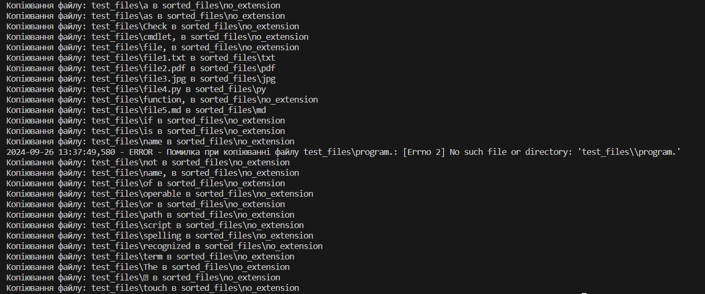
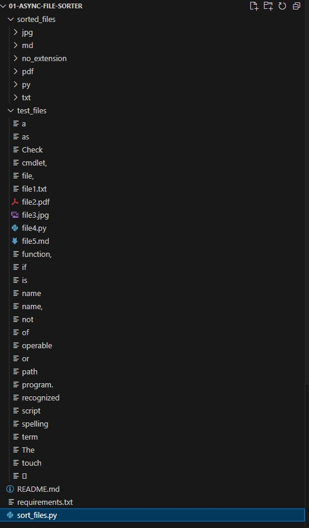

# Async File Sorter

## Опис

**Async File Sorter** — це Python-скрипт, який асинхронно сортує файли з вихідної папки до папок призначення на основі розширень файлів. Скрипт допомагає обробляти великі обсяги файлів з високою продуктивністю завдяки використанню асинхронного програмування.

## Використані технології
- Python 3.7+
- asyncio
- aiofiles
- shutil

## Функціонал
- Асинхронне рекурсивне читання файлів у вихідній папці.
- Копіювання файлів у підпапки на основі розширення файлів.
- Логування помилок під час обробки.

## Вимоги до середовища

Для запуску проєкту вам потрібен Python 3.7+.

## Установка

1. Клонування репозиторію:

```bash
git clone <https://github.com/yourusername/async-file-sorter.git>
```

2. Перехід до директорії проєкту:
```bash
cd async-file-sorter
```

3. Встановлення залежностей:
```bash
pip install -r requirements.txt
```

4. Запуск
Для запуску скрипту потрібно вказати вихідну та цільову папки:

```bash
python sort_files.py <source_folder> <output_folder>
```

Де:

source_folder — папка, з якої будуть читатися файли.
output_folder — папка, в яку будуть копіюватися файли.

5. Приклад:
```bash
python sort_files.py ./input ./output
```

6. Після завершення роботи скрипту в папці output будуть створені підпапки з розширеннями файлів та файли будуть скопійовані в відповідні папки.



7. Результат роботи скрипту:

