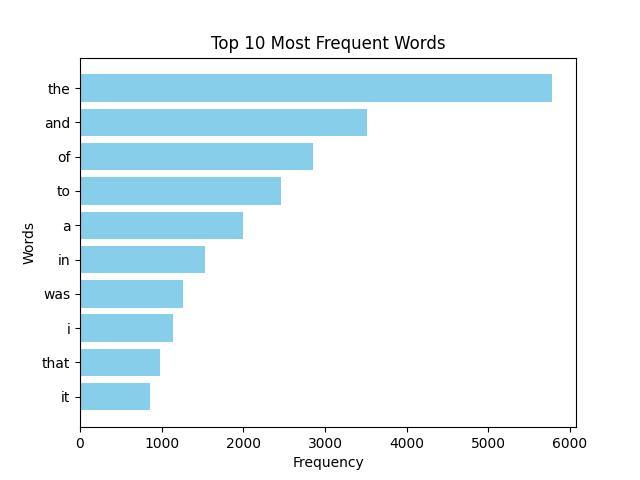

# Word Frequency MapReduce

## Опис

Цей Python-скрипт завантажує текст із заданої URL-адреси, виконує аналіз частоти використання слів із використанням парадигми MapReduce та візуалізує топ-слова за частотою використання.

## Вимоги

- Python 3.7+
- requests
- matplotlib

## Інсталяція

1. Клонуйте репозиторій:

```bash
git clone <https://github.com/yourusername/word-frequency-mapreduce.git>
```

2. Перейдіть до папки проєкту:
```bash
cd word-frequency-mapreduce
```

3. Встановіть залежності:
```bash
pip install -r requirements.txt
```

4. Запуск
Для запуску скрипту:

```bash
python mapreduce.py
```

5. Введіть URL-адресу тексту, який ви хочете проаналізувати.
Exapmle: https://www.gutenberg.org/cache/epub/12577/pg12577.txt 

Скрипт завантажить текст із заданої URL-адреси та відобразить топ 10 найбільш частих слів.


6. Після завершення обробки ви побачите графік топ-слів за частотою використання.

Title: **Strange True Stories of Louisiana**

Author: **George Washington Cable**

Release date: June 1, 2004 [eBook #12577]
              Most recently updated: December 15, 2020

Language: English




